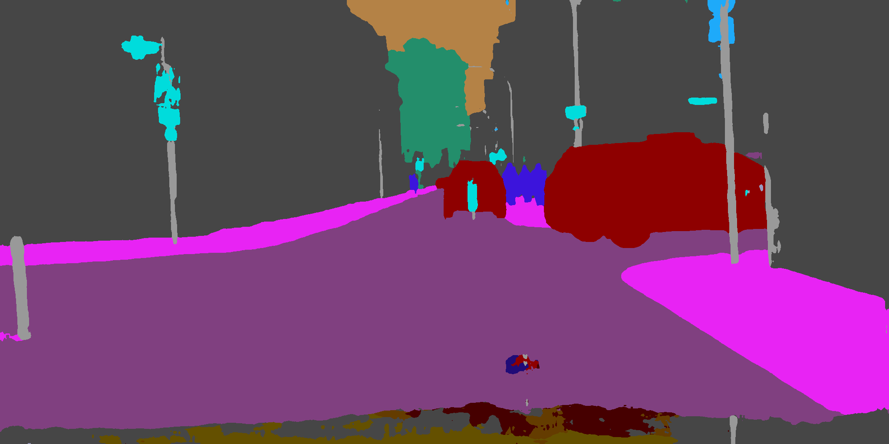

# Semantic Segmentation using DeepLab

This repository performs inference using deeplab model.

Input Image           |  Predictions
:-------------------------:|:-------------------------:
  |  

## Features

- Perform inference to images specified in data/cityscapes/images directory.
- Custom trained checkpoints can be specified in data/cityscapes/checkpoint directory.
- The semantic predictions are blended and overlayed on the input image. 


## Dependencies

The current repository requires [tensorflow](https://www.tensorflow.org/) v2.7+, [opencv](https://docs.opencv.org) v4.5+, [yaml](https://github.com/yaml/libyaml) to run.

## Install instructions

### Install bazel. 

E.g. provided for ubuntu. If other OS, please follow the instructions in [bazel installation](https://bazel.build/start)

```bash
$ sudo apt install apt-transport-https curl gnupg -y
$ curl -fsSL https://bazel.build/bazel-release.pub.gpg | gpg --dearmor >bazel-archive-keyring.gpg
$ sudo mv bazel-archive-keyring.gpg /usr/share/keyrings
$ echo "deb [arch=amd64 signed-by=/usr/share/keyrings/bazel-archive-keyring.gpg] https://storage.googleapis.com/bazel-apt stable jdk1.8" | sudo tee /etc/apt/sources.list.d/bazel.list
$ sudo apt update && sudo apt install bazel-5.1.1

```


### Install tensorflow cpp api

```bash
$ git clone https://github.com/tensorflow/tensorflow.git
$ cd tensorflow
$ git checkout v2.10.0
$ ./configure

The below choices may vary for different installations. As an example I have specified my configuration 

Please specify the location of python. [Default is /usr/bin/python3]: /root/miniconda3/bin/python3
Please specify optimization flags to use during compilation when bazel option "--config=opt" is specified [Default is -march=native]:
Do you wish to use jemalloc as the malloc implementation? [Y/n] n
Do you wish to build TensorFlow with Google Cloud Platform support? [Y/n] n
Do you wish to build TensorFlow with Hadoop File System support? [Y/n] n
Do you wish to build TensorFlow with Amazon S3 File System support? [Y/n] n
Do you wish to build TensorFlow with Apache Kafka Platform support? [Y/n] n
Do you wish to build TensorFlow with XLA JIT support? [y/N] n
Do you wish to build TensorFlow with GDR support? [y/N] n
Do you wish to build TensorFlow with VERBS support? [y/N] n
Do you wish to build TensorFlow with OpenCL SYCL support? [y/N] n
Do you wish to build TensorFlow with CUDA support? [y/N] n
Do you wish to build TensorFlow with ROCm support? [y/N] n
Do you wish to build TensorFlow with TensorRT support? [y/N] n
Found possible Python library paths:
  /root/miniconda3/lib/python3.8/site-packages

$ bazel build --config=opt //tensorflow:libtensorflow_cc.so
```

### Copy the bazel output for tensorflow installation
  
```bash
$ mkdir -p /home/${USER}/tensorflow_lib

$ cp -d bazel-bin/tensorflow/libtensorflow_cc.so* /home/${USER}/tensorflow_lib/
$ cp -d bazel-bin/tensorflow/libtensorflow_framework.so* /home/${USER}/tensorflow_lib/
$ cp -d $tensorflow_root/libtensorflow_framework.so.2 /home/${USER}/tensorflow_lib/libtensorflow_framework.so

$ mkdir -p /home/${USER}/tensorflow_include/
$ mkdir -p /home/${USER}/tensorflow_include/include/
$ mkdir -p /home/${USER}/tensorflow_include/include/tensorflow
$ rsync -avzh --exclude '_virtual_includes/' --include '*/' --include '*.h' --include '*.inc' --exclude '*' bazel-bin/ /home/${USER}/tensorflow_include/include/
$ rsync -avzh --include '*/' --include '*.h' --include '*.inc' --exclude '*' tensorflow/cc /home/${USER}/tensorflow_include/include/tensorflow/
$ rsync -avzh --include '*/' --include '*.h' --include '*.inc' --exclude '*' tensorflow/core /home/${USER}/tensorflow_include/include/tensorflow/
$ rsync -avzh --include '*/' --include '*' --exclude '*.cc' third_party/ /home/${USER}/tensorflow_include/include/third_party/
$ rsync -avzh --include '*/' --include '*' --exclude '*.txt' bazel-tensorflow/external/eigen_archive/Eigen/ /home/${USER}/tensorflow_include/include/Eigen/
$ rsync -avzh --include '*/' --include '*' --exclude '*.txt' bazel-tensorflow/external/eigen_archive/unsupported/ /home/${USER}/tensorflow_include/include/unsupported/
$ rsync -avzh --include '*/' --include '*.h' --include '*.inc' --exclude '*' bazel-tensorflow/external/com_google_protobuf/src/google/ /home/${USER}/tensorflow_include/include/google/
$ rsync -avzh --include '*/' --include '*.h' --include '*.inc' --exclude '*' bazel-tensorflow/external/com_google_absl/absl/ /home/${USER}/tensorflow_include/include/absl/

```

### Set LD_LIBRARY_PATH

```bash
$ export LD_LIBRARY_PATH=$LD_LIBRARY_PATH:/home/${USER}/tensorflow_lib/
```


### Install opencv

```bash
$ sudo apt-get install libopencv-dev python-opencv
```

### Install yaml

```bash
$ sudo apt-get install libyaml-cpp-dev
```

### Install yaml-cpp

```bash
$ sudo apt-get install libyaml-cpp-dev
```


## Building the source and running
There is a Makefile which details the dependencies. Execute the following command for building.

```bash
$ make all
```
Execute the following command to run the inference 
```bash
$ ./deeplab_inference config.yaml
```
## Code structure 

src/image.cpp contains implmentation details for PrepareImage class. Functionality includes 
* opening directory (PrepareImage::OpenDirectory)
* listing images (PrepareImage::ListImagesDir)

src/inference.cpp contains implmentation details for ModelFromPB class. Functionality includes 
* reading the model saved file based on yaml file entry (ModelFromPB::ModelFromPB)
* printing shapes of input and output tensors (ModelFromPB::printInputOutput)
* wrapper to predict inputs specifed in input image folder (ModelFromPB::predictInputs)
* inference of deeplab model and most computational complex part of the code (ModelFromPB::predict)
* coloring logits for display (ModelFromPB::colorLogits)
* postprocessing the logits (ModelFromPB::postprocess)

## Rubric Satisfaction 
* README  - build instructions, code strcuture, dependencies provided.
* Compile & Test - instructions provided to compile and test 
* Loops, Functions, I/O - loops used in main.cpp, image.cpp and inference.cpp. Functions used to fragment the functionality.
* Object Oriented Programming - code is modularized into two classes, Prepare image and ModelFromPB
* Memory Management - In inference.cpp, model loading, output tensor wrting and input tensor loading uses memory management. 


## Reference

We have used the following work for the demo:

1. L.-C. Chen, Y. Zhu, G. Papandreou, F. Schroff, H. Adam. Encoder-Decoder with Atrous Separable Convolution for Semantic Image Segmentation. arXiv:1802.02611, 2018.
2. Marius Cordts, Mohamed Omran, Sebastian Ramos, Timo Rehfeld, Markus Enzweiler, Rodrigo Benenson, Uwe Franke, Stefan Roth, Bernt Schiele, The Cityscapes Dataset for Semantic Urban Scene Understanding. arXiv:1604.01685, 2016. 